# Chapter 3 Image Gallery

These images were extracted from Chapter 3 of the final-year report and placed here so the GitHub repository has visible circuit diagrams, component images, and simulation screenshots.

Folder:

```text
docs/images/chapter3/
```

## Figures

### Figure 3.1.1 - Simple Transformer
- Source: Chapter 3, page 26
- File: `docs/images/chapter3/figure_3_1_1_simple_transformer.png`

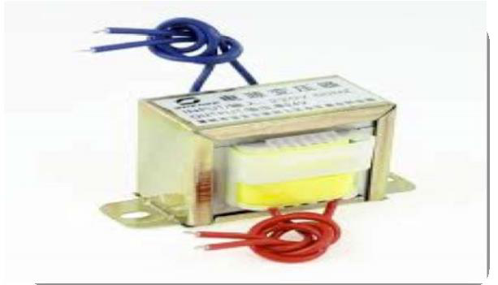

### Figure 3.1.2 - Transformer Block Diagram
- Source: Chapter 3, page 26
- File: `docs/images/chapter3/figure_3_1_2_transformer_block_diagram.png`

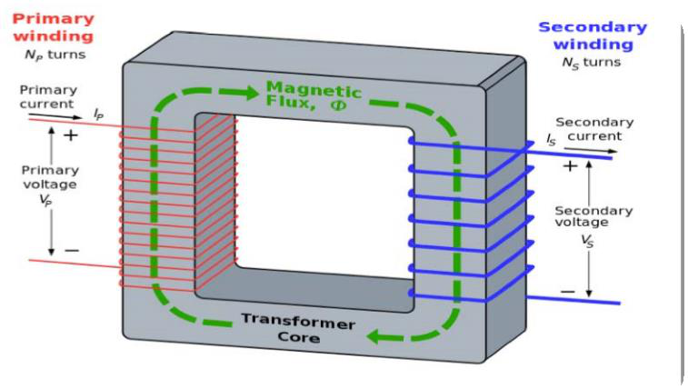

### Figure 3.1.3 - Transformer Construction and Symbol
- Source: Chapter 3, page 27
- File: `docs/images/chapter3/figure_3_1_3_transformer_construction_symbol.png`

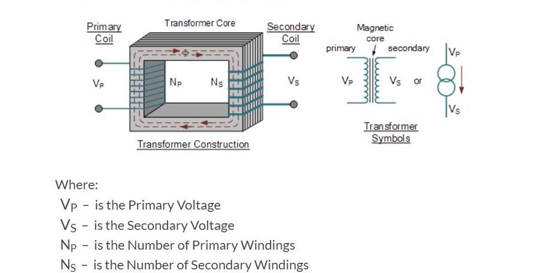

### Figure 3.1.4 - Unfiltered Full-Wave Bridge Rectifier Circuit
- Source: Chapter 3, page 28
- File: `docs/images/chapter3/figure_3_1_4_unfiltered_bridge_rectifier.png`

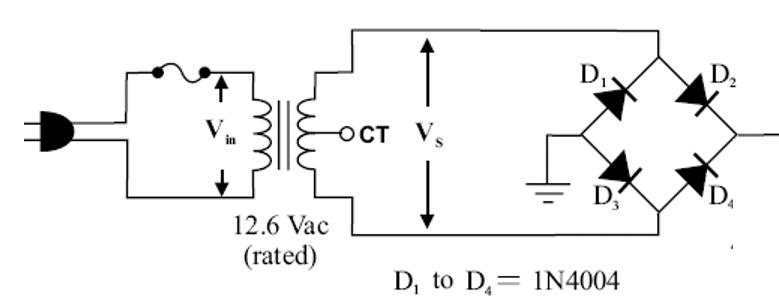

### Figure 3.1.5a - Filtered Full-Wave Rectifier Circuit
- Source: Chapter 3, page 29
- File: `docs/images/chapter3/figure_3_1_5a_filtered_full_wave_rectifier.png`

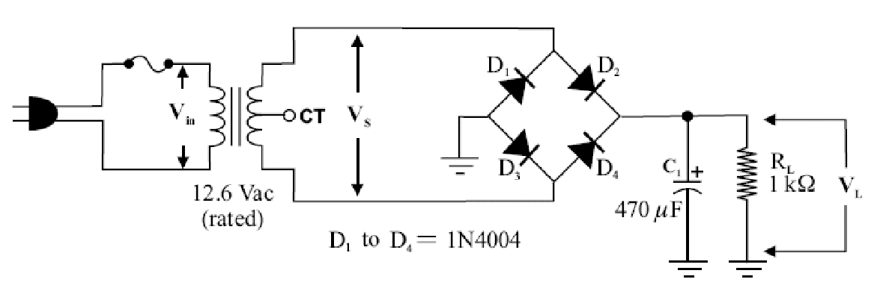

### Figure 3.1.5b - Rectifier Output Waveform
- Source: Chapter 3, page 29
- File: `docs/images/chapter3/figure_3_1_5b_rectifier_output_waveform.png`

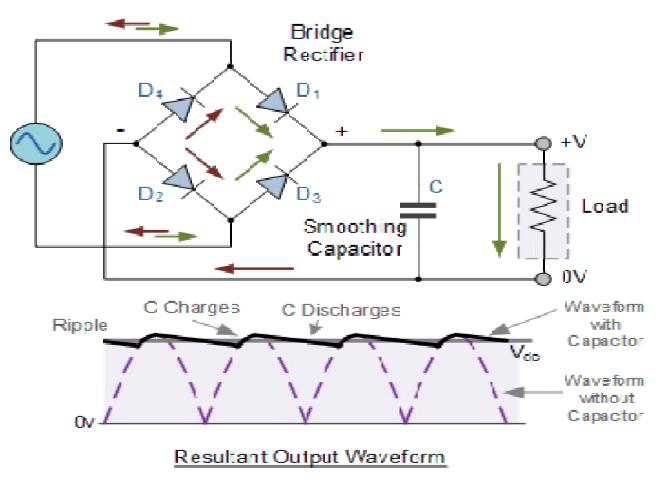

### Figure 3.1.6 - LM78XX Voltage Regulator
- Source: Chapter 3, page 30
- File: `docs/images/chapter3/figure_3_1_6_lm78xx_voltage_regulator.png`

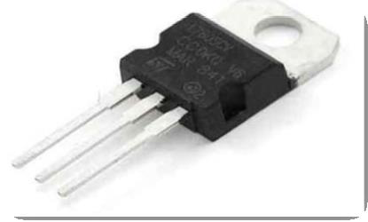

### Figure 3.1.7 - Capacitors
- Source: Chapter 3, page 31
- File: `docs/images/chapter3/figure_3_1_7_capacitors.png`

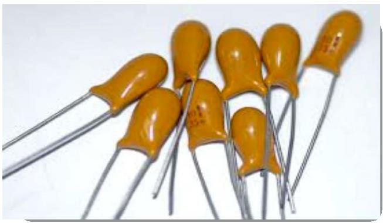

### Figure 3.1.8 - LED Block Diagram and Color Types
- Source: Chapter 3, page 32
- File: `docs/images/chapter3/figure_3_1_8_led_diagram_and_types.png`

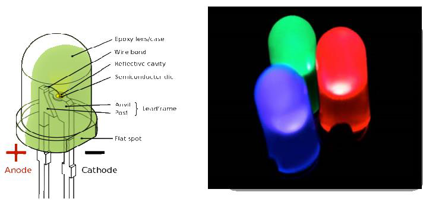

### Figure 3.2.1 - 8051 Microcontroller Pin Diagram on Proteus
- Source: Chapter 3, page 33
- File: `docs/images/chapter3/figure_3_2_1_8051_pin_diagram_proteus.png`

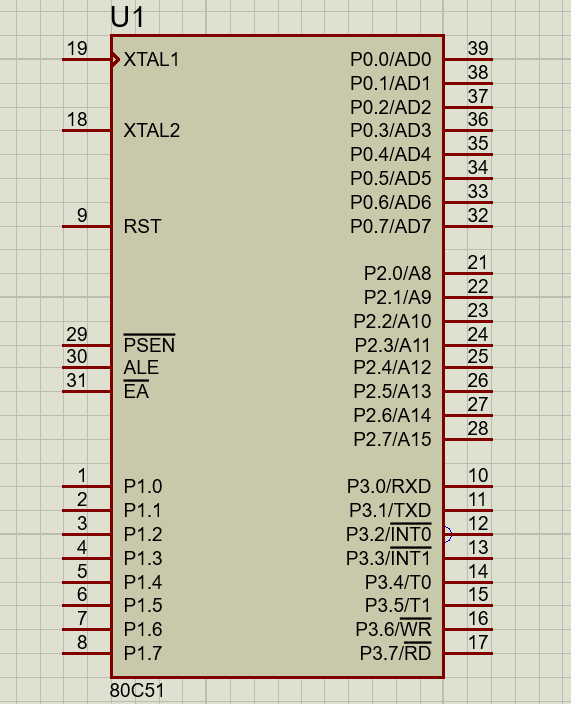

### Figure 3.2.2 - HC-05 Bluetooth Module Front and Back View
- Source: Chapter 3, page 34
- File: `docs/images/chapter3/figure_3_2_2_hc05_bluetooth_module_front_back.png`

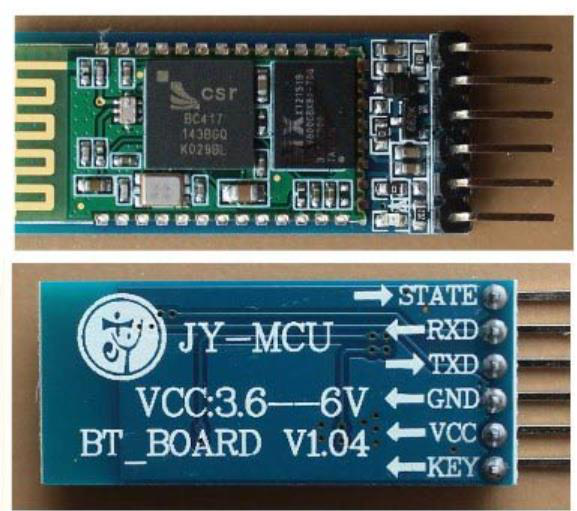

### Figure 3.2.3 - HC-05 Bluetooth Configuration Pins
- Source: Chapter 3, page 34
- File: `docs/images/chapter3/figure_3_2_3_hc05_configuration_pins.png`

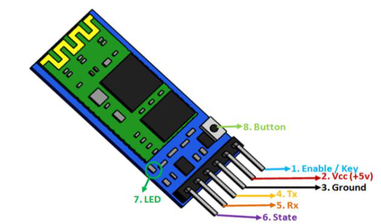

### Figure 3.2.4 - Bluetooth Data Transfer Block Diagram
- Source: Chapter 3, page 35
- File: `docs/images/chapter3/figure_3_2_4_bluetooth_data_transfer_block_diagram.png`

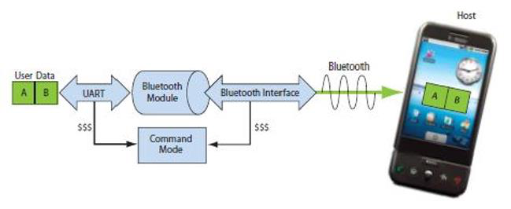

### Figure 3.2.5 - Bluetooth App Interface
- Source: Chapter 3, page 35
- File: `docs/images/chapter3/figure_3_2_5_bluetooth_app_interface.png`


### Figure 3.2.6a - Relay Module
- Source: Chapter 3, page 36
- File: `docs/images/chapter3/figure_3_2_6a_relay_module.png`

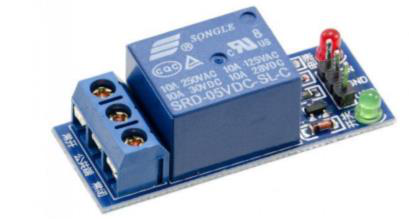

### Figure 3.2.6b - Relay Component
- Source: Chapter 3, page 36
- File: `docs/images/chapter3/figure_3_2_6b_relay_component.png`

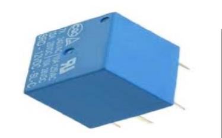

### Figure 3.2.7 - Darlington IC ULN2003A
- Source: Chapter 3, page 38
- File: `docs/images/chapter3/figure_3_2_7_uln2003a_darlington_ic.png`

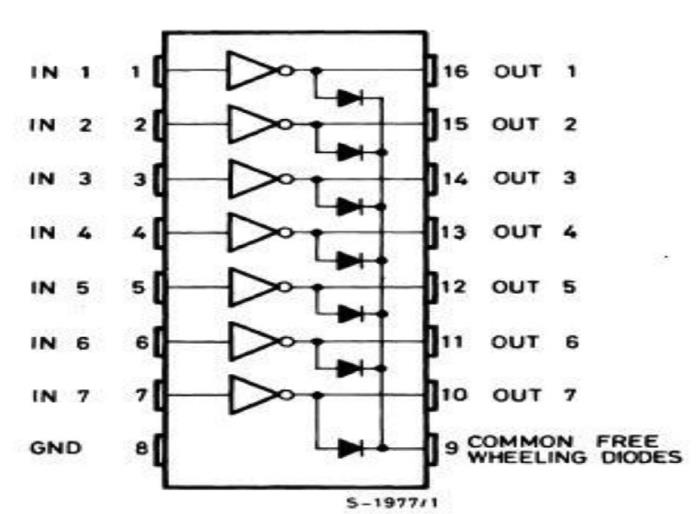

### Figure 3.2.8 - LCD Display
- Source: Chapter 3, page 38
- File: `docs/images/chapter3/figure_3_2_8_lcd_display.png`

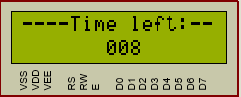

### Figure 3.3.1 - Switching a Load
- Source: Chapter 3, page 44
- File: `docs/images/chapter3/figure_3_3_1_switching_a_load.png`

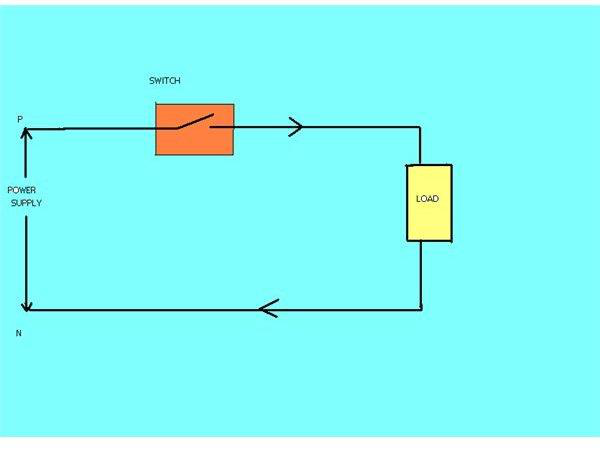

### Figure 3.3.2 - Internal Diagram of a Simple Buzzer
- Source: Chapter 3, page 45
- File: `docs/images/chapter3/figure_3_3_2_simple_buzzer_circuit.png`

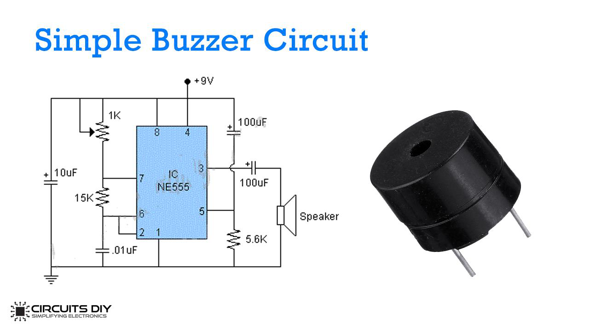

### Figure 3.4.0 - Home Automation System Block Diagram
- Source: Chapter 3, page 47
- File: `docs/images/chapter3/figure_3_4_0_home_automation_block_diagram.png`

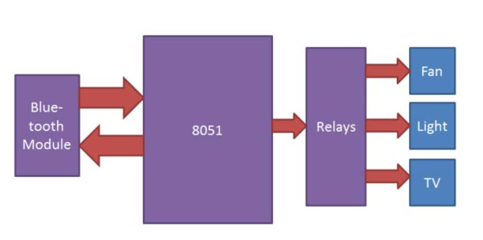

### Figure 3.4.1 - Home Automation System Operation
- Source: Chapter 3, page 48
- File: `docs/images/chapter3/figure_3_4_1_home_automation_operation.png`

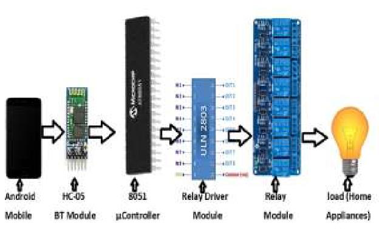

### Figure 3.4.2 - Power Control Circuit
- Source: Chapter 3, page 49
- File: `docs/images/chapter3/figure_3_4_2_power_control_circuit.png`

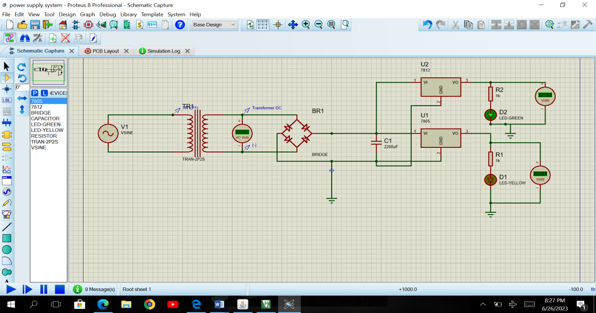

### Figure 3.4.4 - A.C. Voltage Input Wave
- Source: Chapter 3, page 49
- File: `docs/images/chapter3/figure_3_4_4_ac_voltage_input_wave.png`

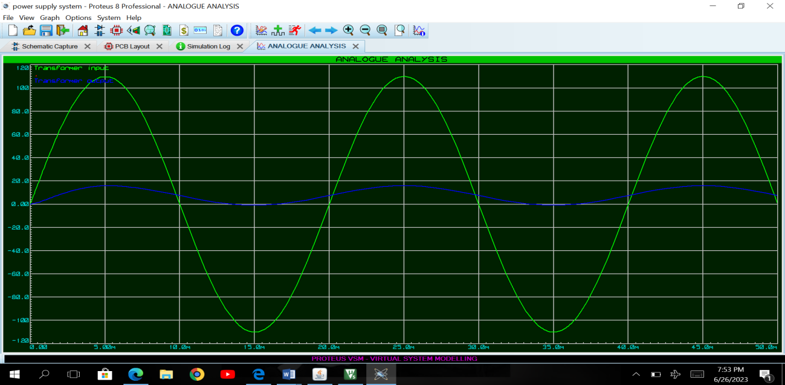

### Figure 4.4.5 - DC Output Voltage
- Source: Chapter 3, page 50
- File: `docs/images/chapter3/figure_4_4_5_dc_output_voltage.png`

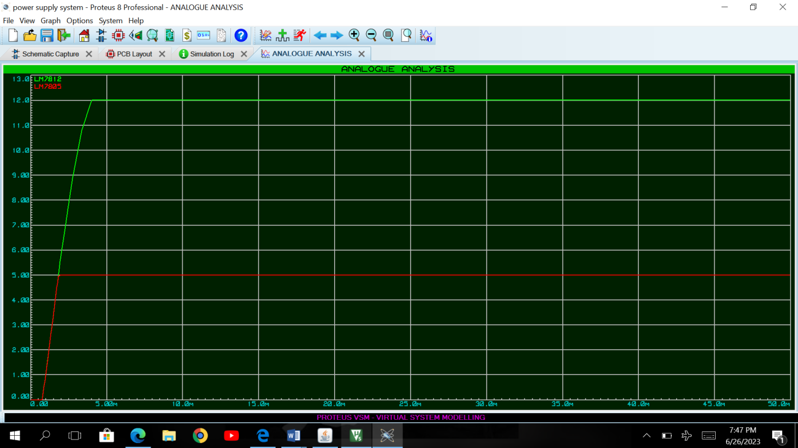

### Figure 3.4.6 - LCD Interface
- Source: Chapter 3, page 51
- File: `docs/images/chapter3/figure_3_4_6_lcd_interface.png`

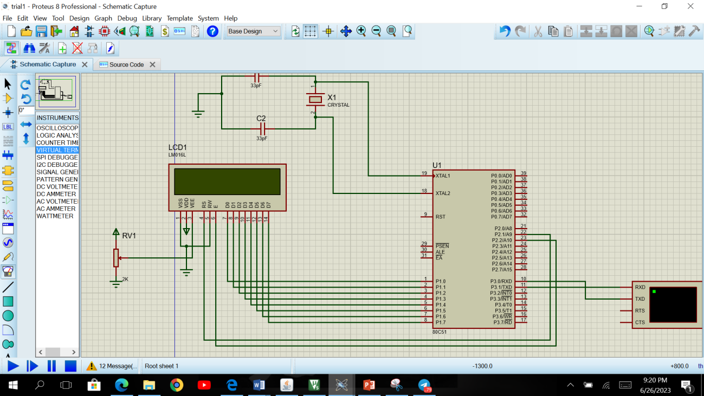

### Figure 3.4.6 - Bluetooth Interface
- Source: Chapter 3, page 53
- File: `docs/images/chapter3/figure_3_4_6_bluetooth_interface.png`

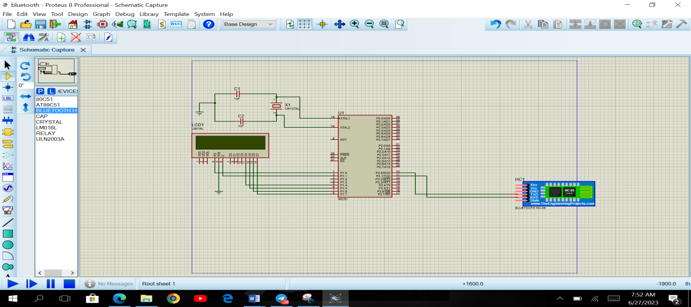

### Figure 3.4.7 - Load Interface
- Source: Chapter 3, page 54
- File: `docs/images/chapter3/figure_3_4_7_load_interface.png`

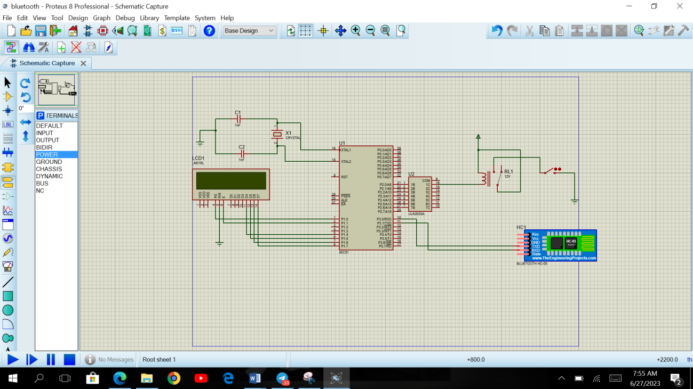

### Smart Home Concept Reference Image
- Source: Chapter 3, page 55
- File: `docs/images/chapter3/smart_home_concept_reference.png`

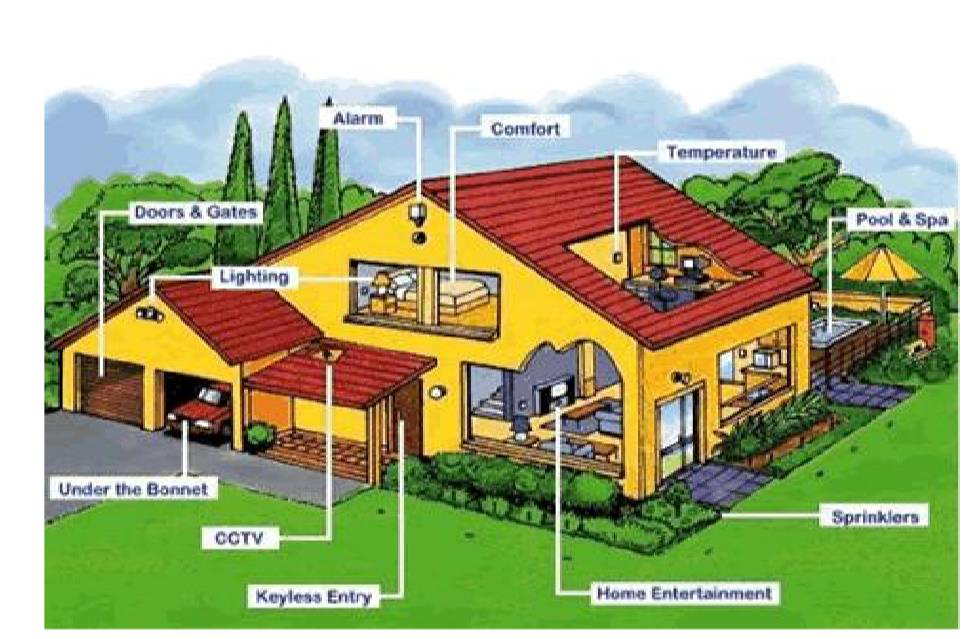

### Home Automation Flowchart
- Source: Chapter 3, page 56
- File: `docs/images/chapter3/home_automation_flowchart.png`

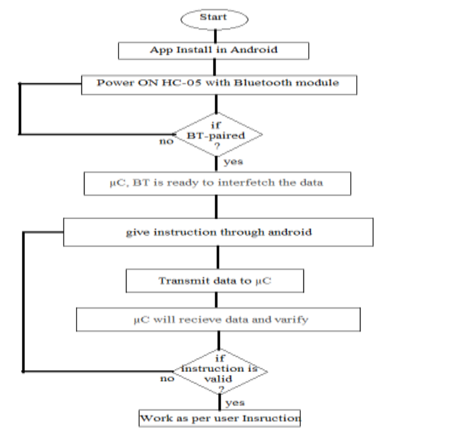

### Figure 3.4.8 - Home Automation Circuit Diagram
- Source: Chapter 3, page 57
- File: `docs/images/chapter3/figure_3_4_8_home_automation_circuit_diagram.png`

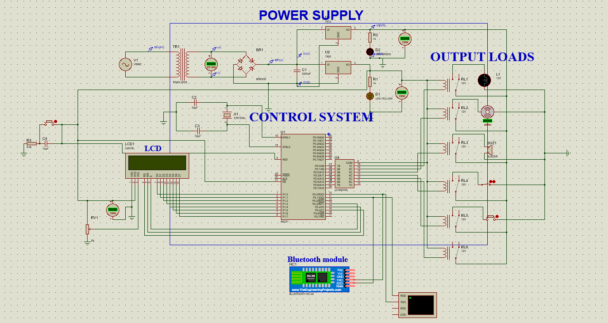
